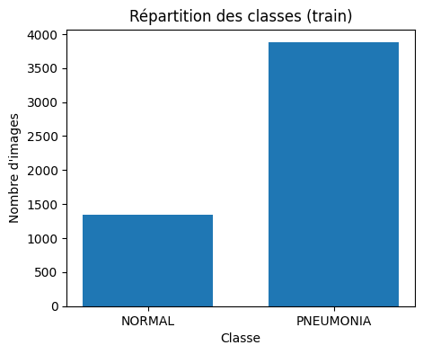
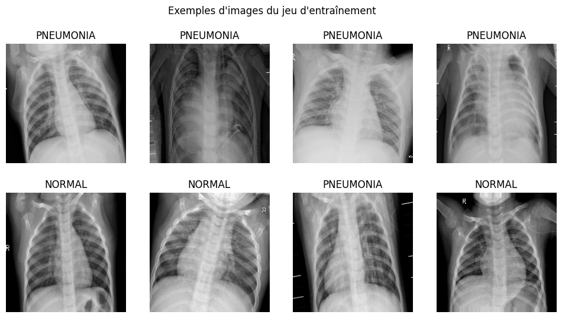
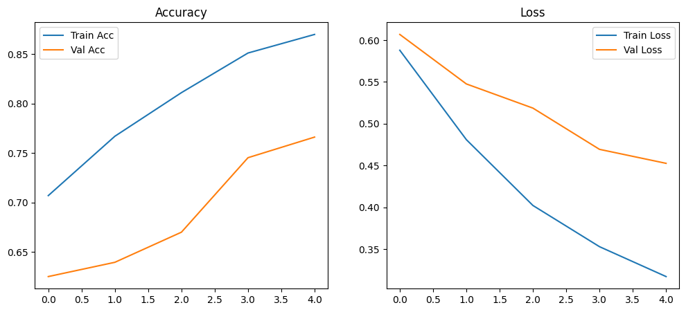
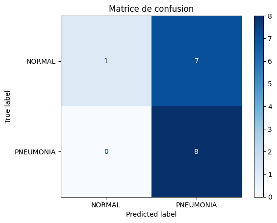
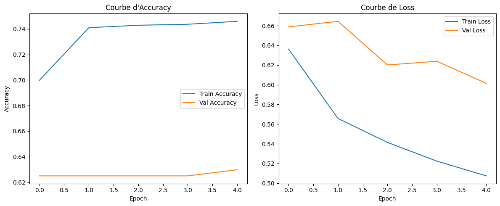
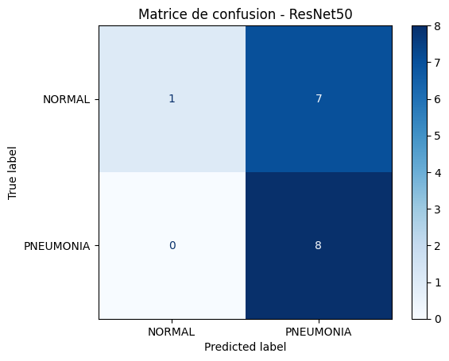
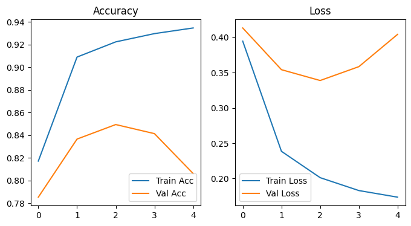
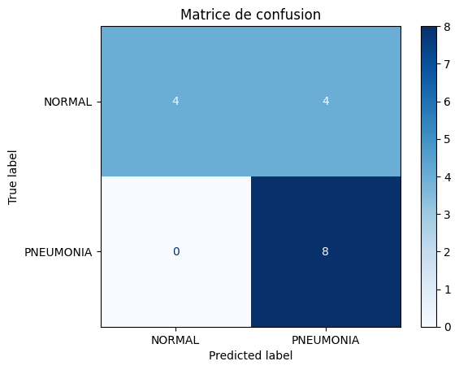
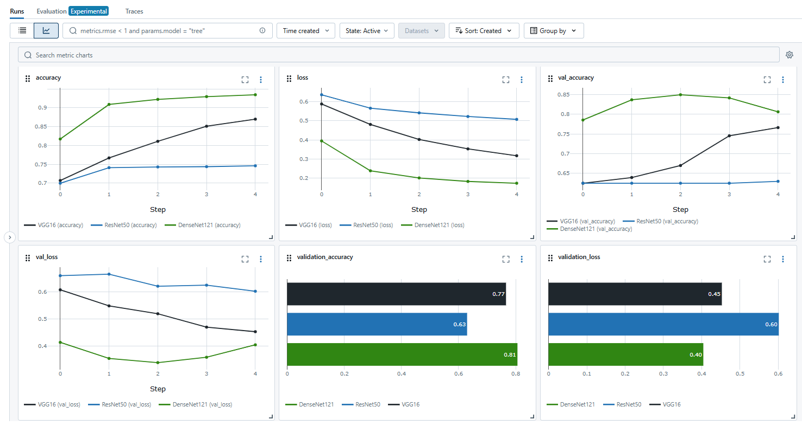

# 🩺 Détection de la Pneumonie sur Radiographies Thoraciques par Deep Learning

Ce projet présente une **preuve de concept (proof of concept)** pour un système de classification binaire de radios thoraciques visant à détecter des cas de **pneumonie**. Le modèle repose sur le **transfert d’apprentissage (transfer learning)** à partir de réseaux de neurones convolutifs (CNN) préentraînés, adaptés à la tâche de classification médicale.

Le pipeline couvre l’ensemble du traitement : **préparation des données**, **entraînement**, **évaluation**, et **suivi MLOps** avec MLflow.

Ce projet a été réalisé dans le cadre de la formation "Développeur en Intelligence Artificielle" dispensée par Simplon.co.

---

## 📦 Données

Le dataset utilisé est le **Chest X-Ray Pneumonia**, accessible ici :  
🔗 https://www.kaggle.com/datasets/paultimothymooney/chest-xray-pneumonia

📌 **Remarque importante :**  
Le dossier `val` d’origine ne contient que **16 images**, ce qui est **insuffisant pour une validation fiable** pendant l'entraînement.  
👉 Pour y remédier, les répertoires `val` et `test` ont été inversés :  
- l’ancien **test** est utilisé comme **validation**,  
- l’ancien **val** devient le **jeu de test final**, plus petit mais indépendant.

---

## 🧠 Modèles testés & stratégie

Trois modèles CNN ont été comparés dans une optique de transfert learning :

| Modèle       | Type                  | Finetuning       | Justification |
|--------------|-----------------------|------------------|---------------|
| **VGG16**     | Architecture classique | Non (couches gelées) | Baseline pédagogique |
| **ResNet50**  | Connexions résiduelles | Oui (dégel des dernières couches) | Robuste, souvent utilisé en clinique |
| **DenseNet121** | Connexions denses     | Oui (finetuning partiel) | Excellente généralisation en imagerie médicale |

Les modèles **ResNet50** et **DenseNet121** ont été partiellement **décongelés (fine-tuning)** pour permettre au réseau d’apprendre des **caractéristiques spécifiques aux radios médicales**, au-delà des représentations ImageNet.

🔬 **Référence utile :**  
📄 [CEUR Workshop – Paper 160](https://ceur-ws.org/Vol-3740/paper-160.pdf) démontre l’efficacité de DenseNet et ResNet pour la classification de maladies respiratoires sur imagerie thoracique.

---
## 🧩 Présentation des modèles CNN

### 📉 VGG16

VGG16 est une architecture de réseau de neurones convolutifs développée par l’équipe d’Oxford Visual Geometry 
Group (VGG). Elle se caractérise par :

- Une **structure simple et uniforme** : empilement de couches convolutionnelles 3x3 avec ReLU, suivies de 
max-pooling.
- **16 couches profondes** (d’où le nom VGG16), incluant 13 convolutions et 3 couches fully connected.

Elle a été largement utilisée comme **modèle de référence (baseline)** en vision par ordinateur.

**Avantages clés :**
- Facile à comprendre et à implémenter.
- Très utilisée dans les travaux pédagogiques.
- Offre de bonnes performances sur des tâches simples.

**Limites :**
- Plus lourde en nombre de paramètres.
- Moins efficace sur des tâches complexes ou spécifiques (comme l’imagerie médicale).
- Moins adaptée à des contextes où la généralisation fine est nécessaire.

### 🧬 DenseNet121

DenseNet (Dense Convolutional Network) est une architecture introduite pour améliorer le **flux d’information 
entre les couches** d’un réseau profond.  
Dans DenseNet121 :

- Chaque couche est **connectée à toutes les couches suivantes**, ce qui permet une **meilleure réutilisation 
des caractéristiques** et une **réduction du surapprentissage**.
- Moins de paramètres que d’autres architectures classiques à profondeur équivalente.
- Très adapté aux tâches médicales, car il extrait des **caractéristiques fines** pertinentes pour l’imagerie.

**Avantages clés :**
- Très bonne **propagation du gradient**.
- Plus efficace avec **moins de données**.
- Utilisé dans de nombreuses études en imagerie médicale.

### 🔗 ResNet50

ResNet (Residual Network) introduit le concept de **connexions résiduelles** ou "skip connections", qui 
permettent de **sauter une ou plusieurs couches** pendant l’entraînement.

- ResNet50 contient 50 couches profondes.
- Ces connexions permettent d’**éviter le problème de dégradation** dans les réseaux très profonds (où les 
performances empirent à mesure que le réseau s'approfondit).
- Très robuste et utilisé comme **standard dans les applications industrielles et médicales**.

**Avantages clés :**
- Permet des réseaux très profonds sans perte de performance.
- Très bon compromis entre performance et complexité.
- Architecture éprouvée dans des contextes réels.

---

## 🖼️ Exploration du dataset
* Il y a près de 3 fois plus d’images de patients atteints de pneumonie que d’images normales.
* Ce déséquilibre peut amener le modèle à prédire la classe majoritaire, ici "PNEUMONIA", simplement parce que 
c’est statistiquement plus fréquent.
* Le fait d’avoir plus d’images pour la pneumonie permet au modèle de mieux apprendre ses différentes manifestations visuelles.
* Les radios présentent une variabilité importante selon les cas, soulignant l’intérêt d’un modèle capable d’en 
extraire des **caractéristiques discriminantes robustes**.


🎯 Implications pour l’apprentissage
* Risque : un modèle qui atteint 85% d'accuracy pourrait simplement toujours prédire "PNEUMONIA".
* Conséquence clinique : des faux positifs peuvent être tolérés (mieux vaut suspecter une pneumonie par erreur que de la rater), mais les faux négatifs (cas de pneumonie classés "NORMAL") sont dangereux.

 
 


---

## ⚙️ Démarche de modélisation

1. **Prétraitement :** redimensionnement (224x224 ,taille standard pour les modèles ImageNet), normalisation.
2. **Transfert learning :**
   - Phase 1 : entraînement sur des couches gelées.
   - Phase 2 : **finetuning** des dernières couches pour ResNet50/DenseNet121.
3. **Évaluation :**
   - Accuracy, Loss, ROC-AUC, matrice de confusion.
4. **Suivi MLOps :**
   - Utilisation de **MLflow** pour tracer chaque expérience.

---

## 📈 Comparaison des résultats

| Modèle       | Accuracy Test | AUC    | Observations |
|--------------|----------------|--------|--------------|
| **VGG16**     | 85%            | 0.94   | Overfitting léger, bon rappel, mais précision sur classe "normal" à améliorer |
| **ResNet50**  | 79%            | 0.83   | Très bon équilibre précision/rappel |
| **DenseNet121** | **94%**      | **0.97** | Meilleure généralisation, surtout avec fine-tuning |

---


Les courbes ci-dessous montrent la progression de l’**accuracy**, de la **loss** et de la **matrice de confusion** sur les ensembles d'entraînement et de validation pour chaque modèle :
### 📉 VGG16

 
 

### 🔗 ResNet50
 
 

### 🧬 DenseNet121
 
 

✅ DenseNet121 se distingue par un apprentissage stable et des performances fiables, avec de meilleurs résultats sur les métriques d’évaluation, même lorsque le jeu de test est limité.

👉 Des notebooks séparés sont disponibles pour chaque modèle testé (VGG16, ResNet50, DenseNet121).
Chacun présente en détail les étapes spécifiques d'entraînement, les performances obtenues, les visualisations de métriques et les particularités du fine-tuning.

🔍 Consulte-les pour approfondir l'analyse de chaque modèle.

---

## 🧰 Suivi MLOps avec MLflow

Un suivi rigoureux des expériences a été mis en place avec **MLflow** :

- **Tracking automatique** (metrics, modèles)
- **Comparaison multi-modèles** sur l’interface Web

📸 L’interface MLflow :



---

## 7️⃣ Conclusion & perspectives

🎯 Ce projet montre qu'un **prototype basé sur le transfert learning** peut fournir des résultats prometteurs pour la détection automatisée de pneumonie sur radios thoraciques.

👉 DenseNet121, couplé à un finetuning partiel, offre les **meilleures performances** parmi les modèles testés.

🔄 **Prochaines étapes :**
- Intégrer d'autres métriques orientées médical (sensibilité, spécificité).
- Tester sur un dataset plus diversifié.
- Ajouter une interface utilisateur pour test clinique.
- Déployer le modèle via API (Flask/FastAPI).


## 📂 Structure du projet
```plaintext
📁 data/chest_xray/
├── train/
├── val/              # (utilisé comme test final)
└── test/             # (utilisé comme validation)
📜 VGG16.ipynb
📜 ResNet50.ipynb
📜 DenseNet121.ipynb
📜 README.md
📜 requirements.txt
📁 images/
